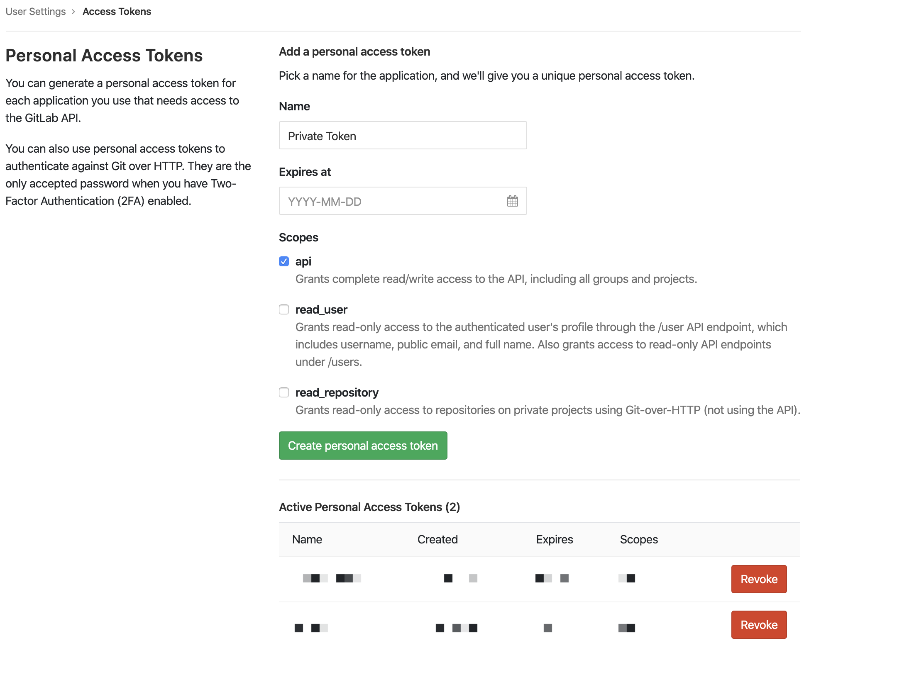
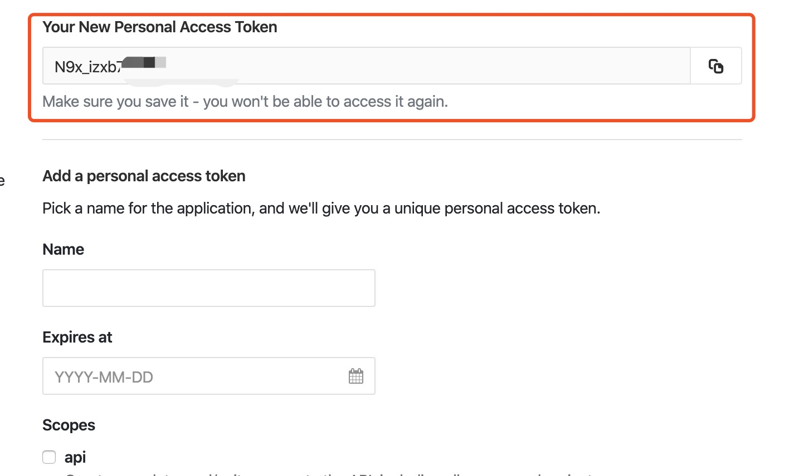
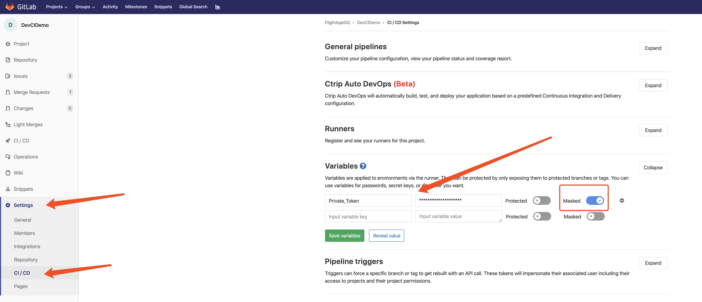

# 安装
**目前安装只支持`linux`/`mac os`**

执行命令`
curl 10.32.164.25:9527/setCICD.sh > setCICD.sh && curl 10.32.164.25:9527/modifyPackageJson.js > modifyPackageJson.js && sh setCICD.sh`
此命令会快速创建`ci/cd`和`mantis`配置

执行完之后根据需要修改以下内容
```json
{
    "script":{
      "cicdtest": "", // 一般为 jest --coverage --silent -w 1
      "cicdlint": "" // 一般为 eslint './src/**/*.{ts,tsx,js,jsx}
    },
    "devCIConfig": {
      "appType": "trip" // 主板的名称 <trip|ctrip|wx> 分别为 <trip主板｜携程中文主板｜微信小程序>
    },
    "mantisConfig": {
      "staticLintCMD": "<lint command>" | ['<lint command>','ut command'] // commit之前执行,支持工具链
    }
}
```
## 必要的手动配置
1. 创建gitlab api access token
   打开 http://git.ctripcorp.com/profile/personal_access_tokens 
     
     
2. 生成后复制生成的token，注意保存
   
   
3. 进入到项目的`setting > CI/CD>Variables`,并填入生成的token，注意要勾选`masked`，这样gitlab日志中将隐藏掉token
    
    
4. 点击 `Save variables`结束配置
    
5. 另外除了`Private_Token`必须配置外
    可选配`CHECK_MODIFIED_FILE`，值为 `[(1|其他)]`,此变量控制代码检测范围，为'1'时，只检测本次push比较上次push，修改、新增的**js|jsx|ts|tsx**文件
     ```bash
        if [[ "${CHECK_MODIFIED_FILE}" == "1" ]]; then
            npx eslint `git diff --name-only ${CI_COMMIT_SHA} ${CI_COMMIT_BEFORE_SHA} --diff-filter=ACMR |grep -E '\.(js|jsx|ts|tsx)$'| xargs`
        else
            npm run cicdlint
        fi
    ```
