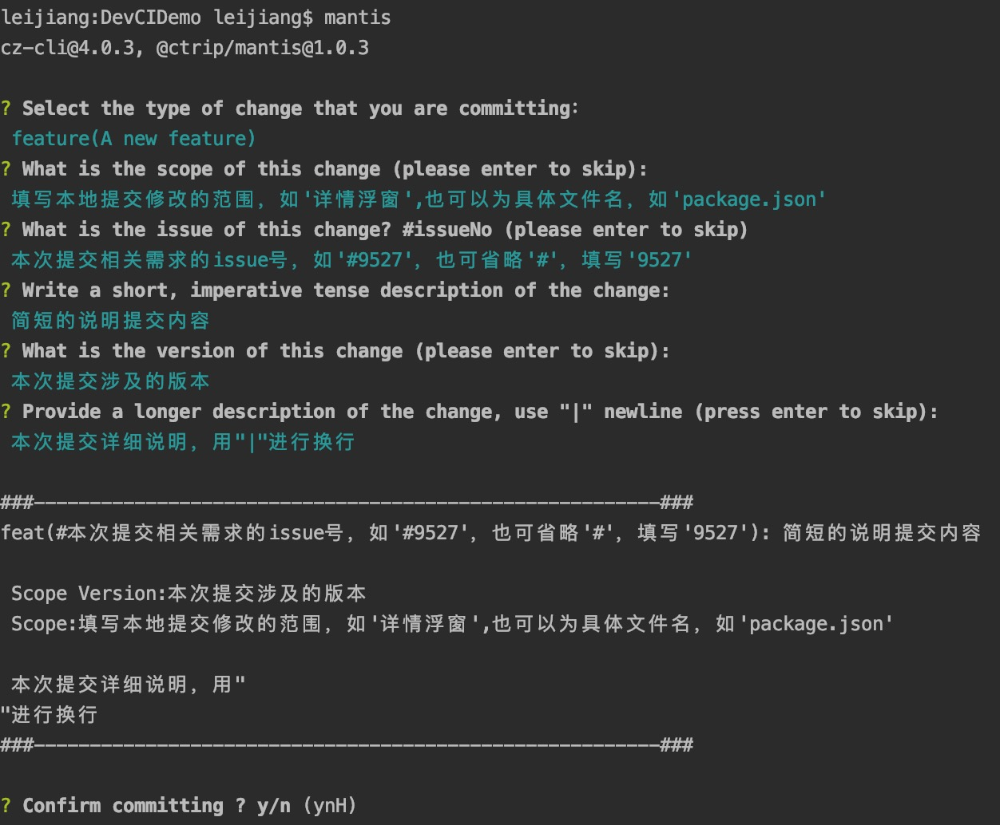

# 各阶段工具使用

## 创建issue阶段
      在代码仓库创建issue,并完成需求明细的填写
参与者： 产品经理
    
使用工具： gitlab


---
## 评审阶段
   
 参与者：产品经理、测试工程师、开发工程师

---
## issueFormat填写阶段
    
参与者： 测试工程师、开发工程师
   
 使用工具： [issueFormat](../issueFormat/introduction.md)
   
 
 
---
## 开发阶段
   
 参与者： 开发工程师
   
 使用工具： [mantis](../mantis/introduction.md)、[gitlab CI/CD](../CI/introduction.md)、MCD
  
  说明：
```
          1.  本地使用mantis commit代码时，按提示填入相应信息

          2.  merge request时在CI/CD执行ut、代码检查、跑issue指定的测试案例

          3.  merge完成会自动触发mcd发布
```


